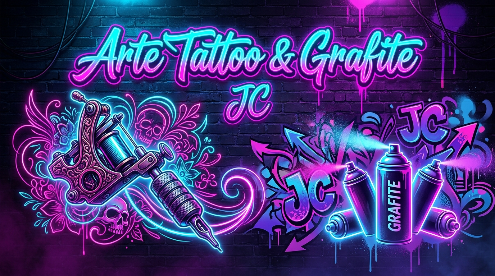

# Arte Tatoo E Grafite JC - Site Vitrine Local

<p align="center">
  
</p>

Este projeto é um site vitrine profissional de alta conversão estruturado com foco em **SEO Local** e **Google Maps**. O design foi desenvolvido com uma estética Neon-Dark de alto impacto para atrair clientes.

---

## Estrutura do Projeto

Abaixo está a disposição das pastas e arquivos do repositório:

```text
├── .agents/
│   └── AGENTS.md                 # Diretivas Locais do Projeto (ICAE + DOE)
├── assets/
│   └── cover.jpg                 # Imagem de capa do projeto
├── docs/                         # Central de Documentação e Manuais Técnicos
│   ├── README.md                 # Índice Geral da documentação
│   ├── arquitetura-projeto.md    # Detalhamento da arquitetura ICAE + DOE
│   ├── atualizar-dados-cliente.md# Guia para atualização dos dados do cliente
│   ├── publicacao-github-pages.md# Guia de publicação no GitHub Pages
│   └── status-projeto.md         # Kanban e progresso de atividades
├── .gitignore                    # Arquivos ignorados pelo Git
├── app.js                        # Motor de Injeção e SEO (Orchestration)
├── config.js                     # Central de Dados do Cliente (Execution)
├── index.html                    # Esqueleto Semântico (Directives)
├── styles.css                    # Folha de Estilos Neon-Dark (Directives)
└── README.md                     # Documentação Principal do Projeto
```

---

## Documentação de Apoio Operacional

Para manter as configurações protegidas, atualizar as informações do cliente e gerenciar o deploy do site, consulte os manuais detalhados criados na pasta `/docs`:

- [**Central de Documentação (Índice Geral)**](./docs/README.md)
- [**1. Arquitetura do Projeto (ICAE + DOE)**](./docs/arquitetura-projeto.md) — Compreenda como a divisão em camadas facilita a customização e manutenção.
- [**2. Como Atualizar os Dados do Cliente**](./docs/atualizar-dados-cliente.md) — Passo a passo para alterar textos, contatos e imagens do portfólio.
- [**3. Como Publicar no GitHub Pages**](./docs/publicacao-github-pages.md) — Guia prático de hospedagem gratuita.
- [**4. Status do Projeto (Kanban / Checklist)**](./docs/status-projeto.md) — Acompanhamento do progresso das tarefas pendentes e concluídas.
